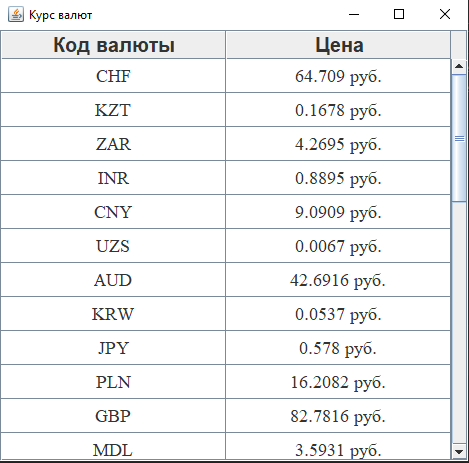

# CurrencyParser

Parser of exchange rates

You can download .jar file from /src and then run the application.

This program is written on Java SE.

<h3>Here is a screenshot of how this application works:</h3>

